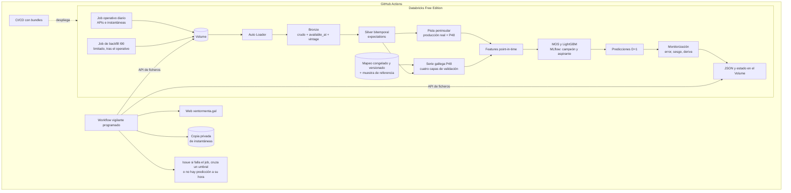

# VenTormenta

**Red Eléctrica no publica cuánta electricidad eólica se programa en Galicia cada hora. VenTormenta la reconstruye con datos públicos del mercado, mide su error, la contrasta con la cifra oficial y la predice para el día siguiente en Databricks, sin hacer trampas con el tiempo.**

Autor: Aarón Prado Darriba · Lugo, Galicia
Categoría: Ingeniería de datos y ML aplicado
Web: ventormenta.gal (gallego y castellano)
Licencia del código: GPL-3.0 (sección 14)
**Documento final y congelado.** A partir de aquí, los cambios se deciden con resultados (sección 16).

**Estado de la evidencia**:

| Etiqueta | Significado |
|---|---|
| ✅ DEMOSTRADO | Comprobado con datos reales |
| 🧪 SPIKE | Pendiente de comprobar en el spike 2 |
| 🎯 OBJETIVO | Criterio fijado de antemano, aún sin resultado |
| 💭 HIPÓTESIS | Suposición razonada, sin comprobar |

---

## 1. Resumen ejecutivo

Según Red Eléctrica, Galicia es la tercera comunidad en producción eólica de España, pero su producción solo se publica por meses. ✅ Lo que sí es público, a los 90 días y sin agregar, es el programa de cada unidad de programación del mercado eléctrico, cuarto de hora a cuarto de hora. ✅

VenTormenta:

1. **Reconstruye la serie horaria de generación eólica programada (P48) de Galicia** a partir de las unidades eólicas gallegas. 🧪
2. **Mide la calidad de esa reconstrucción** con capas independientes: cobertura en potencia frente a la potencia instalada oficial (diaria), error horario del método en el sistema peninsular (una referencia optimista del error gallego, no una cota 💭) y contraste mensual con el total oficial de Galicia, que solo genera avisos y nunca se usa para ajustar nada.
3. **Predice la generación eólica programada del día siguiente** con información estrictamente disponible a la hora de decidir (*point-in-time correct*).
4. **Mide cuánto se engañaría a sí mismo con las fugas temporales habituales**: cuánto promete de más el backtest y cuánto empeora el modelo en uso real. Ese catálogo es el resultado principal.
5. **Monitoriza el modelo con etiquetas de dos velocidades**: la peninsular llega al día siguiente; la gallega, a los 90 días.

**Qué no es**: la serie gallega no es producción medida en contador ni un dato oficial. Es una reconstrucción a partir de programas de mercado, con su calidad medida y publicada.

---

## 2. Cómo se llegó aquí

### 2.1 Spike de fuentes (ejecutado) ✅

| Comprobación | Resultado |
|---|---|
| Salida a internet desde Databricks Free Edition (cuenta verificada) hacia REData, e·sios, Open-Meteo y Overpass | Accesibles: toda la ingesta en Databricks |
| REData, producción eólica de Galicia | Solo anual y mensual |
| e·sios, dato de Galicia | Solo potencia instalada eólica (diaria) |
| e·sios, sistema peninsular | Producción eólica y previsión de Red Eléctrica |
| Open-Meteo, ejecuciones archivadas de ECMWF IFS | Funcionan sobre Galicia |

No se comprobó la salida desde Databricks hacia otros destinos (GitHub, almacenamiento externo). Por eso todos los flujos hacia fuera los inicia GitHub Actions (sección 8).

### 2.2 Alternativas evaluadas

| Alternativa | Decisión |
|---|---|
| Núcleo peninsular + capítulo gallego mensual | Plan de respaldo |
| **Lo anterior + serie gallega reconstruida desde los programas por unidad** | **Elegida, condicionada al spike 2** |
| Previsión de precios | Descartada: sin foco gallego |
| Estimación diaria por reparto de la peninsular | Descartada: su error no se puede medir |
| Otra variable gallega / pedir datos por parque a la Xunta | Descartadas por criterio del autor |

---

## 3. Qué responde el sistema

> ¿Cuánta energía eólica se programó en Galicia cada hora, y con qué calidad lo sabemos?

> Con la información disponible antes de las 12:00 (hora peninsular) de D-1, ¿cuánta generación eólica programada habrá el día D, con qué incertidumbre?

> **¿Cuánto mejor parecería el modelo, y cuánto peor funcionaría de verdad, si cometiera las fugas temporales habituales?**

**Objetivo de predicción**: la generación eólica **programada** (P48), incluidas las horas con redespacho a la baja por restricciones. No se reconstruye ni se publica la generación que habría permitido el viento.

---

## 4. Estructura: producto y banco de pruebas

| | Pista peninsular | Pista gallega |
|---|---|---|
| Papel | Banco de pruebas operativo y control del método | **Producto** |
| Etiqueta | Producción real (e·sios), al día siguiente | P48 reconstruido, a los 90 días |
| Para qué | Operar en vivo desde el principio; medir el error del proxy P48; monitorización con etiquetas rápidas; comparación con Red Eléctrica | Serie y previsión gallegas |

---

## 5. Alcance: núcleo y extensiones

### 5.1 Núcleo obligatorio (versión 0.5)

Publicable por sí solo y medible sin ninguna extensión. Si la pista gallega falla en el spike 2, el núcleo se cierra con el plan de respaldo.

1. **Esqueleto Databricks desplegado desde CI**: bundles, Unity Catalog, Volumes y Auto Loader.
2. **Instantáneas diarias** de la previsión de Red Eléctrica a las 12:00 de D-1, con copia semanal privada.
3. **Workflow vigilante en GitHub Actions**: recoge las salidas, publica, guarda la copia y abre issues (sección 8).
4. **Pista peninsular en operación diaria**: features point-in-time, ponderación geoespacial por grupos de potencia, MOS, intervalo empírico por cuantiles y monitorización básica con alertas.
5. **Serie gallega reconstruida** con protocolo de mapeo congelado, muestra de referencia estratificada y las cuatro capas de validación (o, si el spike 2 falla, capítulo gallego mensual).
6. **LightGBM peninsular y catálogo de fugas del núcleo** (sección 9.1).
7. **README** con resultados y estado de la evidencia.

### 5.2 Extensiones (en este orden, con el núcleo cerrado)

1. Previsión gallega con MOS, walk-forward con latencia D+90 y replay con retraso de detección; incluye la fuga de etiqueta no publicada.
2. LightGBM en la pista gallega.
3. Intervalos conformales en ambas pistas; incluye la fuga de calibración de intervalos.
4. Web de una página en gallego y castellano.
5. Vídeo de tres minutos y artículo para LinkedIn.

### 5.3 Lista de recortes (escrita de antemano)

Si una fase supera en un 30% lo previsto, se recorta en este orden:

1. Vídeo y artículo.
2. Castellano de la web (queda el gallego).
3. LightGBM gallego.
4. Dos entradas del catálogo, y solo estas: la variante de 12 UTC de la ejecución posterior al corte (queda la de 06 UTC) y la fuga de hiperparámetros.
5. Replay gallego completo (queda una ventana de tres meses).

**No se recorta nunca**: corrección temporal, el resto del catálogo del núcleo, la validación de la reconstrucción, los baselines, la evaluación temporal, MLflow, el pipeline reproducible, la monitorización básica, Databricks y la documentación de las limitaciones.

### 5.4 Después de la 1.0

- **Enero–febrero de 2027**: actualización con las primeras etiquetas gallegas reales de predicciones hechas en vivo.
- Web en inglés.
- IA generativa: extracción de las resoluciones de parques eólicos del DOG como evidencia del mapeo y cronología de la repotenciación.
- Análisis mensual de la repotenciación; ablación con MeteoGalicia; despliegue de prueba en Azure Databricks.

### 5.5 Fuera de alcance

Cuantificación pública de recortes, generación "sin recortes", series o rankings por unidad o titular, previsión por parque, precios, API de backend, deep learning, Databricks Apps, Model Serving y uso comercial.

---

## 6. Los datos

### 6.1 Fuentes

| Fuente | Contenido | Uso |
|---|---|---|
| e·sios · ficheros I90 (archivo 34) | Programas por unidad de programación y cuarto de hora, públicos a los 90 días sin agregación ✅ | Serie gallega y cierre peninsular |
| e·sios · listados de unidades de programación y unidades físicas | Identificación y potencia de las unidades | Mapeo y ponderación por MW |
| e·sios · indicadores | Producción eólica peninsular, previsión de Red Eléctrica, potencia instalada eólica de Galicia (diaria) ✅ | Etiqueta peninsular, cierre del método, referencia externa, **cobertura en potencia** |
| Red Eléctrica · REData | Producción eólica mensual de Galicia ✅ | **Solo contraste mensual de aviso**, guardado con su fecha de descarga |
| Open-Meteo · Single Runs API | ECMWF IFS HRES (9 km) desde el 14 de marzo de 2024 | Features |
| Open-Meteo · Historical Weather API | IFS de 9 km archivado desde 2017 | Referencia de "verdad meteorológica" en el catálogo de fugas |
| OpenStreetMap | Ubicación de aerogeneradores y parques | Agrupación geoespacial y apoyo al mapeo |

**Cuota de Open-Meteo**: el uso gratuito exige menos de 10.000 llamadas diarias, 5.000 por hora y 600 por minuto, y cada ubicación cuenta como una llamada (más si se piden muchos días o variables). El diseño geoespacial se ajusta a un presupuesto documentado (sección 8.3).

### 6.2 Reconstrucción de la serie gallega

1. **Ingesta**: un fichero I90 por día, descargado una sola vez al hacerse público (D+90), en un Volume; Auto Loader detecta los nuevos.
2. **Parseo**: programa final P48 por unidad y cuarto de hora con `python-esios`. 🧪 Si no lee bien los ficheros cuartohorarios, parser propio con pandas.
3. **Mapeo**: tabla versionada que clasifica cada unidad eólica como gallega, de otra comunidad o mixta/desconocida, con su evidencia.
4. **Estado operativo por unidad**: un P48 nulo sostenido marca la unidad como parada o desmontada (repotenciación en obras).
5. **Agregación**: suma horaria de las unidades gallegas operativas.

### 6.3 Protocolo del mapeo (garantía de que REData no influye)

- El mapeo se **congela con hash y tag antes de calcular cualquier contraste con REData**.
- Cualquier cambio posterior solo se admite con evidencia externa anotada en la tabla y como versión nueva. Se publica el historial de versiones con el contraste de cada una.
- Los tres meses del spike 2 se publican como **meses de desarrollo**, fuera del criterio 1.
- **Muestra de referencia estratificada**: unidades clasificadas como gallegas, como de fuera y como desconocidas, verificadas con evidencia que el mapeador no usa. Se publican la precisión y la exhaustividad **ponderadas por MW**, con intervalo.

### 6.4 Validación en cuatro capas

| Capa | Qué mide | Tratamiento en el pipeline |
|---|---|---|
| **Cobertura en potencia (diaria)** | MW de las unidades físicas mapeadas y operativas frente a la potencia eólica gallega diaria de e·sios. Independiente de REData | Expectation con cuarentena si cae por debajo de un umbral fijado en el spike 2 |
| **Cierre horario peninsular** | Error horario del método (P48 frente a producción real). Referencia optimista del error gallego, no una cota 💭: si los errores fueran independientes, el error relativo gallego sería del orden de √(potencia peninsular / potencia gallega) ≈ 2,9 veces el peninsular | Base del análisis de sensibilidad del criterio 2 |
| **Contraste mensual gallego** | Sesgo y cobertura frente a REData; desviación publicada con signo | **Solo aviso**: se registra, nunca se descarta ni va a cuarentena |
| **Cotas físicas** | Coherencia básica (nunca por encima de la potencia instalada; correlación con el viento) | Control de errores groseros, no validación fuerte |

**Tolerancia mensual derivada**: se mide primero la diferencia mensual entre P48 y producción real en la península; la tolerancia gallega es esa diferencia más 3 puntos de margen para el mapeo, con un máximo del 5%. La regla y su valor se fijan en el spike 2, antes de mapear.

**Horas con restricciones**: como el objetivo es la generación programada, se entrena con todas las horas. 🧪 Si los I90 permiten identificar el redespacho a la baja, las métricas se estratifican con esa máscara (la misma para todos los modelos), con resultados con y sin ella. Uso interno; no se publica ninguna cuantificación de recortes.

### 6.5 Problemas conocidos de la etiqueta

| Efecto | Tratamiento |
|---|---|
| Programa frente a medida real | Cierre horario peninsular y análisis de sensibilidad al ruido de etiqueta |
| Redespachos dentro del P48 | Objetivo declarado como generación programada; métricas estratificadas |
| Repotenciación: en la ventana de datos domina la parada durante las obras; el +35% es la estimación de la Xunta tras terminarlas | Estado operativo por unidad; normalización por potencia mapeada operativa |
| Operación reforzada desde el 28 de abril de 2025 | Corte de análisis |
| Paso a programación cuartohoraria (octubre de 2025) | Cambio de esquema: lo detectan los tests de estructura |
| Cambio de modelo meteorológico (IFS 50R1 desde el 12 de mayo de 2026) | Corte de análisis; caso descriptivo del monitor |

### 6.6 Spike 2 (decide la pista gallega)

**Meses de prueba** (después, meses de desarrollo): enero de 2025, junio de 2025 (dato oficial: 437.131 MWh ✅) y enero de 2026.

**Comprobaciones**:
1. Estructura de los I90 en los tres meses; programa exacto que se toma como etiqueta; desglose por unidad física; hojas que agreguen por provincia o zona; identificación de redespachos; que `python-esios` lee los ficheros cuartohorarios.
2. Campos y potencias de los listados de unidades.
3. Diferencia mensual P48–producción real peninsular y tolerancia gallega resultante.
4. Mapeo, congelación, cobertura en potencia y contraste mensual frente a REData.
5. Cómo cuenta la Single Runs API las llamadas y presupuesto de llamadas resultante.
6. Descarga de ficheros del Volume desde GitHub Actions con la API de ficheros de Databricks.
7. Disponibilidad en Free Edition de Feature Engineering en Unity Catalog, Auto Loader sobre Volumes y tablas de sistema.
8. Número efectivo de días independientes por régimen.

**Criterio para continuar**: cobertura en potencia por encima del umbral y los tres meses dentro de la tolerancia derivada, sin escalar con REData. Si no, plan de respaldo.

---

## 7. Honestidad temporal

### 7.1 Clase de disponibilidad y *vintage*

| Clase | Significado | Ejemplos |
|---|---|---|
| Observada | Hora de disponibilidad registrada al capturar | Datos capturados en vivo |
| Inferida por regla | Hora de ejecución o publicación + latencia supuesta | Backfill de previsiones; etiquetas gallegas (D+90) |
| No reproducible | No podía conocerse entonces por quien construye el sistema | Hindcasts anteriores a la operación del ciclo 49R1; previsiones de 9 km anteriores al 1 de octubre de 2025, cuando solo era abierta la de 0,25° |

Cada fila archivada guarda además su **vintage**: la fecha en que ese archivo fue accesible. En el replay, un modelo reentrenado el día T solo usa filas cuyo vintage es anterior a T. Se publica qué fracción del entrenamiento y la evaluación cae en cada clase, y **las métricas principales se informan solo sobre el periodo reproducible**.

### 7.2 Mecanismos

- Ejecución fija de 00 UTC de D-1 para el día D; corte a las 12:00 hora peninsular (CET/CEST).
- Días de cambio de hora: 23 o 25 horas, 92 o 100 cuartos de hora.
- Columnas bitemporales: `valid_time` (en la clave primaria), `available_at` (clave temporal del join as-of contra la hora de decisión), `ingested_at`, vintage y clase de disponibilidad.
- Latencia de etiqueta: el modelo gallego reentrenado el día T solo usa etiquetas anteriores a T-90.
- **Un solo mecanismo point-in-time**: Feature Engineering de Unity Catalog si está disponible sin fricción; si no, as-of propio. Tests de propiedad y casos calculados a mano.
- **Paridad entrenamiento-servicio**: en vivo se pide a la Single Runs API la misma ejecución de 00 UTC que en el backfill, nunca la API de previsión estándar, que combina ejecuciones.
- Comparación con Red Eléctrica solo con instantáneas propias.
- Análisis de sensibilidad de las latencias supuestas.

---

## 8. Arquitectura

### 8.1 Diagrama

### 8.2 Componentes de Databricks

| Componente | Uso |
|---|---|
| Unity Catalog | Catálogo, Volumes, tablas de features, registro de modelos |
| Auto Loader (`binaryFile`) | Ingesta incremental de los I90, una sola vez cada uno |
| Lakeflow Spark Declarative Pipelines (antes Delta Live Tables) | Un único pipeline con varios flujos; expectations de cuarentena (estructura, cobertura en potencia) y de aviso (contraste mensual) |
| Delta Lake | Tablas bitemporales y tabla de mapeo versionada |
| PySpark | Transformaciones, cruces y agregaciones de la serie y de las previsiones |
| Databricks Jobs | Job operativo diario y job de backfill separado y limitado |
| Declarative Automation Bundles (antes Databricks Asset Bundles) | Jobs y pipelines como código, desplegados desde CI |
| MLflow | Experimentos; modelos en Unity Catalog con alias campeón/aspirante |
| Databricks SQL | Vistas de métricas y monitorización |
| Tablas de sistema (si están disponibles) | Coste por ejecución y puntualidad |

**Flujos hacia fuera invertidos**: Databricks no abre conexiones salvo a las fuentes de datos comprobadas. Un workflow programado de GitHub Actions, con la credencial del despliegue, descarga el JSON, el estado y las instantáneas por la API de ficheros, publica la web, guarda la copia privada y abre issues. Así el sistema puede avisar también de su propia caída: si Databricks no produce nada a su hora, el vigilante lo detecta.

**Protección de la cuota**: el backfill de I90 es un job aparte, limitado por lotes y programado después del operativo.

**Tests**: unitarios de PySpark en CI con Spark local.

### 8.3 Uso responsable de las fuentes

- **e·sios**: token en un secret scope y escáner de secretos en el CI; la web lee una copia propia; cada I90 se descarga una sola vez; reconsultas limitadas a la ventana de revisiones; catálogo de indicadores descargado una vez.
- **Open-Meteo**: presupuesto de llamadas documentado. Los aerogeneradores se agrupan en K puntos ponderados por MW, con Galicia a resolución completa y el resto de la península agrupado. K se fija con el presupuesto (backfill de las ejecuciones necesarias dentro de la cuota diaria, con margen) y se documenta en el README.

### 8.4 Comportamiento ante fallos

Si no hay predicción, la web muestra la última válida y el estado del sistema, y el vigilante abre un issue. Sin inferencia de respaldo fuera de Databricks.

---

## 9. Catálogo de fugas temporales (resultado principal)

Mismo modelo y periodo, una fuga cada vez. La magnitud esperada se escribe antes de medir y se fija con un tag de git. **Para cada fuga se publican dos números**, ambos con intervalo por bootstrap por bloques emparejado:

- **Optimismo**: backtest con la fuga frente a backtest honesto.
- **Coste realizado**: el modelo entrenado con la fuga, alimentado en el test con entradas honestas, frente al modelo honesto.

### 9.1 Núcleo (medible en la pista peninsular)

| Fuga | Cómo se simula | Métrica |
|---|---|---|
| Ejecución posterior al corte | Ejecuciones de 06 y 12 UTC de D-1 | nMAE |
| Persistencia con el D-1 completo | Baseline o feature que usa horas de D-1 posteriores al corte | nMAE |
| Validación aleatoria | K-fold aleatorio frente a walk-forward | nMAE |
| Hiperparámetros con todo el periodo | Ajuste de hiperparámetros con datos del test | nMAE |
| **Vintage** | Ignorar en el reentrenamiento cuándo fue accesible cada fila archivada (hindcasts, 9 km anteriores a la apertura) | nMAE |
| Referencia: verdad meteorológica | Entrenar con el IFS de 9 km archivado del propio día D y servir con previsiones | nMAE (ejemplo más claro de coste realizado) |

### 9.2 Ligadas a extensiones

| Fuga | Extensión | Métrica |
|---|---|---|
| Etiqueta aún no publicada | 1 (previsión gallega) | nMAE |
| Calibración de intervalos con el futuro | 3 (conformal) | Cobertura y pinball loss |

En curso, a medida que se acumulen instantáneas: entrenar con etiquetas revisadas.

---

## 10. Modelo, evaluación y monitorización

### 10.1 Modelos

| Modelo | Papel |
|---|---|
| **Persistencia point-in-time** (solo peninsular): último valor observado antes del corte | Referencia mínima |
| **Climatología point-in-time**: hora × mes, con etiquetas disponibles al decidir (en Galicia, anteriores a T-90) | Referencia principal de los criterios |
| **MOS**: potencia normalizada por grupo con una curva genérica con parada por viento extremo, agregada por MW y calibrada con regresión isotónica | Baseline principal; el primero en operación |
| LightGBM con los vientos por grupo | Modelo candidato |
| Intervalo empírico por cuantiles de residuos recientes (núcleo); conformal (extensión) | Incertidumbre |
| Previsión de Red Eléctrica | Referencia informativa en la pista peninsular |

En la pista gallega no hay persistencia: la última etiqueta disponible al decidir es de hace 91 días.

### 10.2 Geoespacial

Ubicaciones de OpenStreetMap, potencia de las unidades físicas de e·sios (no recuento de aerogeneradores, que sobrepondera los parques antiguos). Agrupación en K puntos ponderados por MW según el presupuesto de la sección 8.3. Funciones espaciales de Databricks o H3 si están disponibles; si no, unión espacial directa con sistema de referencia explícito. Un mapa de grupos en la web.

### 10.3 Métricas: una titular por pregunta

| Pregunta | Métrica titular |
|---|---|
| ¿Es buena la serie gallega? | Cobertura en potencia, precisión y exhaustividad del mapeo ponderadas por MW, desviación mensual con signo |
| ¿Es buena la previsión? | Skill de nMAE frente a climatología y MOS, con intervalo (bootstrap por bloques) |
| ¿Son fiables los intervalos? | Cobertura y pinball loss |
| ¿Cuánto engañan las fugas? | Optimismo y coste realizado |

nMAE normalizado por la potencia mapeada operativa (Galicia) o instalada (península). El resto va en un anexo técnico.

### 10.4 Monitorización

- **Pista peninsular, en vivo**: nMAE móvil, sesgo, cobertura móvil del intervalo empírico y deriva de features y predicciones, con umbrales preregistrados; el vigilante abre un issue al cruzarlos.
- **Validación del monitor con derivas sintéticas** de fecha y magnitud conocidas: pérdida del 5–10% de la potencia, sesgo de +0,5 m/s en el viento, un grupo con el viento congelado y desfase de una hora en `valid_time`. Se publican la probabilidad y el retraso de detección según la magnitud, y la tasa de falsas alarmas.
- **Casos descriptivos**: el cambio a IFS 50R1. El paso a cuartohorario lo detectan los tests de estructura, no el monitor.
- **Pista gallega, replay**: etiquetas llegando a D+90, con los residuos peninsulares (que llegan en D+1) como indicador adelantado. Se mide el retraso de detección con las mismas derivas sintéticas. La ventana de calibración del intervalo gallego va tres meses por detrás, y se documenta su efecto en los cambios de estación.
- **Hito real**: enero–febrero de 2027.

### 10.5 Criterios de éxito (fijados de antemano) 🎯

1. **Serie gallega**: desviación mensual dentro de la tolerancia derivada en al menos el 90% de los meses, excluidos los tres meses de desarrollo, sin escalar con REData y con el mapeo congelado antes del contraste.
2. **Sensibilidad al ruido de etiqueta**: se perturba la serie gallega con residuos P48–producción real peninsulares, remuestreados por bloques y escalados ×1 y ×3. Si el skill, el orden de los modelos y las inflaciones del catálogo se mantienen a ×3, la escala horaria se mantiene; si no, la evaluación gallega pasa a escala diaria.
3. Skill del MOS frente a la climatología point-in-time positivo en cada pista, con intervalo que excluye el cero.
4. Cobertura del intervalo del 80% en 80% ± 5 puntos: en la pista peninsular dentro del núcleo; en la gallega, con la extensión 3.
5. Al menos el 95% de los días de operación con predicción publicada antes del corte.
6. Coste por ejecución diaria ≤ 15 minutos de cómputo serverless (provisional; solo se revisa con motivo documentado).
7. Catálogo del núcleo publicado completo (optimismo y coste realizado, esperado frente a medido); las entradas de extensión, al cerrar su extensión.

Un criterio que el spike 2 muestre inverificable con los días disponibles pasa a informativo, con constancia escrita. Superar al MOS con LightGBM, o a Red Eléctrica, no es criterio de éxito; se informa siempre.

---

## 11. Posicionamiento

La previsión eólica es un campo maduro y existen herramientas que leen los ficheros I90. VenTormenta no compite con ellas. Su aportación es:

- el **catálogo de fugas** con optimismo y coste realizado, reutilizable más allá de la energía;
- el **mapeo de unidades a Galicia** con protocolo verificable, métricas ponderadas por MW y validación independiente;
- una referencia abierta de **forecasting point-in-time con etiquetas de dos velocidades** y un monitor validado con derivas conocidas.

---

## 12. Aporte al portfolio

| Ya demostrado | Nuevo |
|---|---|
| ETL y medallion | Reconstrucción de un dato inexistente con calidad medida y validación independiente |
| Spark y Delta en AWS | Databricks de extremo a extremo: Unity Catalog, Auto Loader, Lakeflow, Jobs, bundles, MLflow en UC |
| Calidad declarativa | Validación en cuatro capas, separando cuarentena y aviso |
| MLflow con visión por computador | ML tabular temporal, curva de potencia por grupos, campeón/aspirante |
| CI | Tests de PySpark en CI, despliegue de assets y vigilante externo |
| — | Catálogo de fugas con optimismo y coste realizado |
| — | Monitor validado con derivas sintéticas; etiquetas tardías |
| — | Resolución de entidades con métricas ponderadas por MW |
| — | Geoespacial aplicado a features con presupuesto de llamadas |
| — | Dominio energético |

---

## 13. Comunicación

**README para dos lectores**, en castellano y en inglés, con **los números antes que la gobernanza**:

- **Primera pantalla**: la frase del encabezado; el stack con las palabras que filtran las ofertas (con los nombres antiguos DLT y Databricks Asset Bundles); tres resultados con número; el gráfico del catálogo de fugas; el estado en vivo.
- **Debajo**: serie gallega, metodología, estado de la evidencia, glosario (P48, I90, MOS, vintage), relación con el temario de la certificación de Databricks y equivalencia en Azure Databricks como diseño.

**Web**: una página con el estado, la serie gallega etiquetada (PROGRAMADO / RECONSTRUIDO / OBSERVADO / PREVISTO), la previsión con su incertidumbre, la calidad de la reconstrucción junto a cada gráfico, la metodología y la fecha de actualización. Aviso permanente: reconstrucción independiente, no dato oficial.

**Reproducibilidad**: manifiesto de fuentes y fechas (incluidas las de descarga de REData), hashes de las instantáneas y del mapeo, scripts de descarga, versiones de esquema y una ejecución completa con datos sintéticos o de muestra redistribuibles.

---

## 14. Licencias y condiciones

- **Código**: GPL-3.0, por la dependencia `python-esios` (GPL-3.0-only). Con un parser propio, el código podría pasar a MIT. Las salidas no quedan sujetas a la GPL.
- **Red Eléctrica (REData y e·sios)**: uso informativo y no comercial, con atribución y fecha; token personal y uso responsable; sin redistribución de datos crudos (la copia de seguridad es privada). La serie gallega se publica agregada.
- **Open-Meteo y ECMWF**: CC BY 4.0, dentro de la cuota gratuita. **OpenStreetMap**: ODbL, derivados en un directorio separado.
- Mapeo publicado sin series por unidad; sin rankings ni análisis por titular. Sin datos personales ni publicidad.

---

## 15. Riesgos y plan por fases

### 15.1 Riesgos

| Riesgo | Mitigación |
|---|---|
| Mapeo insuficiente o unidades mixtas | Spike 2 con cobertura en potencia; plan de respaldo |
| Sesgo del mapeo por mirar REData | Congelación con hash antes del contraste; cambios solo con evidencia externa |
| Error de etiqueta mayor del supuesto | Criterio 2: sensibilidad ×3 y paso a escala diaria |
| Cuota de Open-Meteo | Agrupación en K puntos con presupuesto documentado |
| Salidas bloqueadas o caída de Databricks | Flujos invertidos con vigilante en GitHub Actions |
| Pocos días para tanta estadística | Recuento en el spike 2; criterios inverificables pasan a informativos |
| Cambios de formato de los I90 | Tests de estructura con ficheros de distintas épocas |
| Funcionalidades no disponibles en Free Edition | Alternativa definida para cada una |
| Lectura como sobreingeniería | README con los números primero |
| Malinterpretación o uso político | Etiquetado, calidad junto a cada gráfico, solo agregados, sin cuantificación de recortes |

### 15.2 Fases

Núcleo (versión 0.5) en torno a ocho semanas; versión 1.0 en tres o cuatro meses, sin pasar de cinco.

| Fase | Contenido | Criterio de salida |
|---|---|---|
| 0 · Arranque | Job de instantáneas; vigilante con copia privada; spike 2; **tag de preregistro** con criterios, umbrales y magnitudes esperadas | Instantáneas corriendo; decisión sobre la pista gallega; preregistro fijado antes de medir |
| 1 · Esqueleto | Bundles, CI/CD con tests, Auto Loader, extremo a extremo con datos mínimos | Un despliegue desde CI produce una predicción publicada por el vigilante |
| 2 · Peninsular en operación | Bronze y Silver bitemporales, features point-in-time, geoespacial, MOS, intervalo empírico, monitorización básica | MOS peninsular operando a diario, y sigue corriendo |
| 3 · Serie gallega | Backfill, mapeo congelado, muestra de referencia, cuatro capas | Criterios 1 y 2 evaluados |
| 4 · Fugas | LightGBM peninsular, catálogo del núcleo, derivas sintéticas | Criterio 7 del núcleo → **versión 0.5** |
| 5 · Extensiones | En el orden de 5.2, aplicando la lista de recortes | Extensiones cerradas o recortadas por escrito |
| 6 · Publicación | README, web, reproducibilidad | **Versión 1.0** y hito de enero de 2027 anunciado |

---

## 16. Decisiones cerradas

| Decisión | Motivo |
|---|---|
| Foco en Galicia, serie reconstruida desde los I90 | Única vía a dato horario gallego sin pedir permisos |
| REData no ofrece dato diario de Galicia | Comprobado en el spike de fuentes |
| Solo fuentes que no requieren solicitar permiso (el registro del token de e·sios sí se acepta) | Criterio del autor |
| Databricks Free Edition, con toda la ingesta dentro | Prioridad del autor; conectividad comprobada |
| Objetivo de predicción: generación programada (P48) | Coherente con la etiqueta; evita reconstruir recortes |
| IA generativa, inglés y Azure real, después de la 1.0 | Decisión del autor |
| Sin API de backend, deep learning, Model Serving ni Databricks Apps | Sin señal nueva |
| Sin cuantificación pública de recortes ni análisis por titular | Riesgo de uso indebido |
| Web en gallego y castellano, sin publicidad | Decisión del autor; condiciones no comerciales |
| GPL-3.0 mientras se use `python-esios` | Licencia de la dependencia |
| **Fin de las revisiones del documento** | Auditoría final incorporada; los riesgos pendientes dependen de datos |
